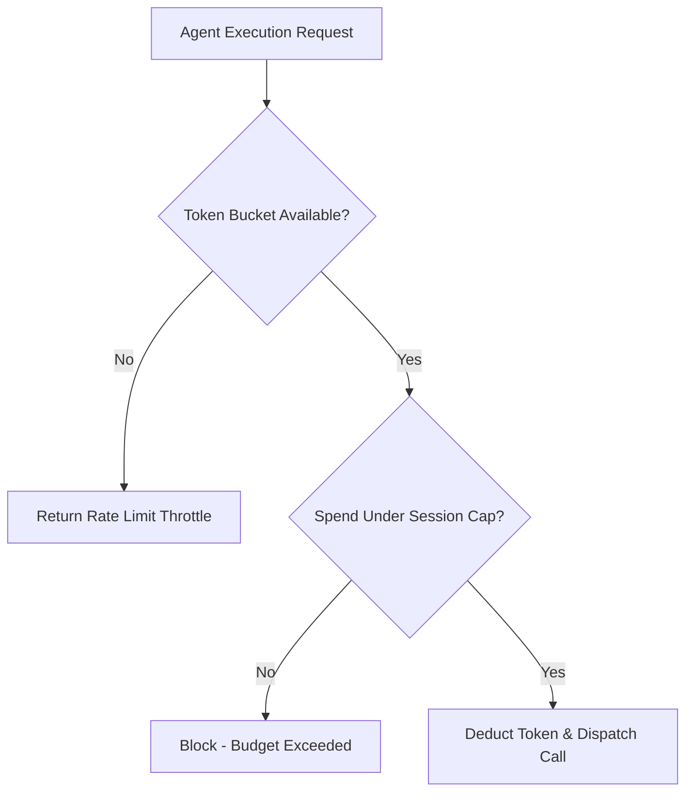

# genpark-agent-budget-rate-limit-throttle-skill

Token bucket rate limiter and budget throttle engine protecting downstream APIs and managing agent session token costs.

Maintained by **GenPark AI** (https://genpark.ai). Access more agent observability and governor skills on the **GenPark Model Context Protocol Directory** (https://genpark.ai/mcp).

## Features
- **Token Bucket Algorithm**: Smooth burst handling with continuous mathematical refill.
- **Hard Dollar Budgeting**: Hard stops runaway recursive agent loops before unexpected cloud bills occur.
- **Zero External Dependencies**: Pure Python standard library.
